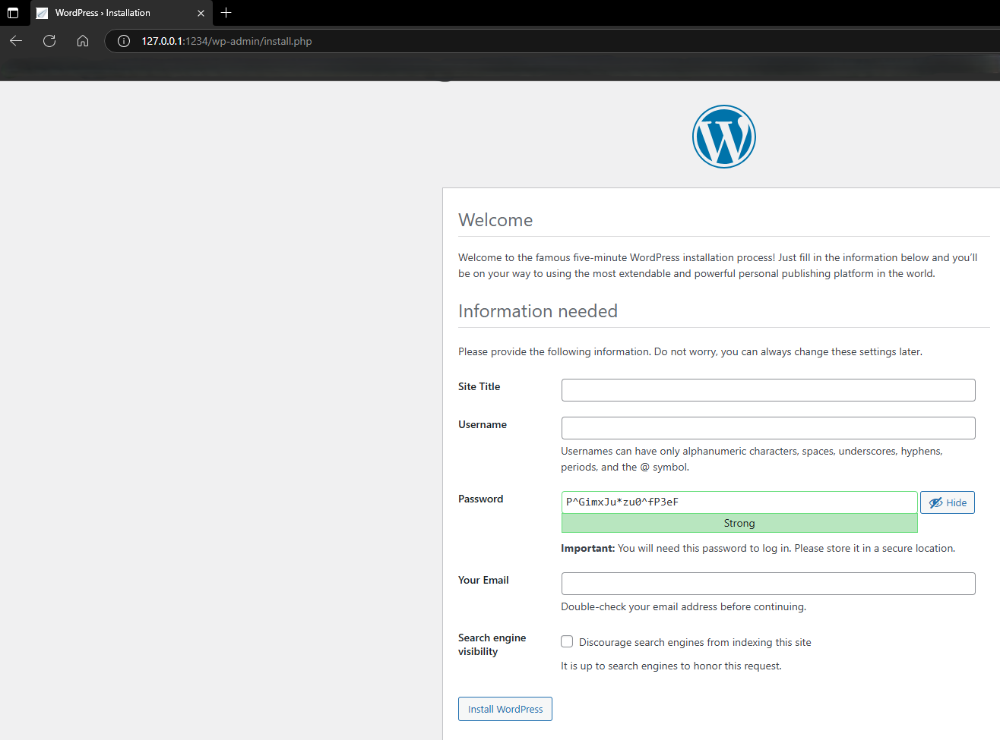
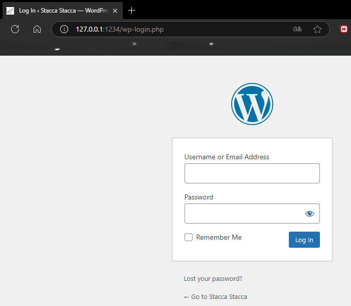
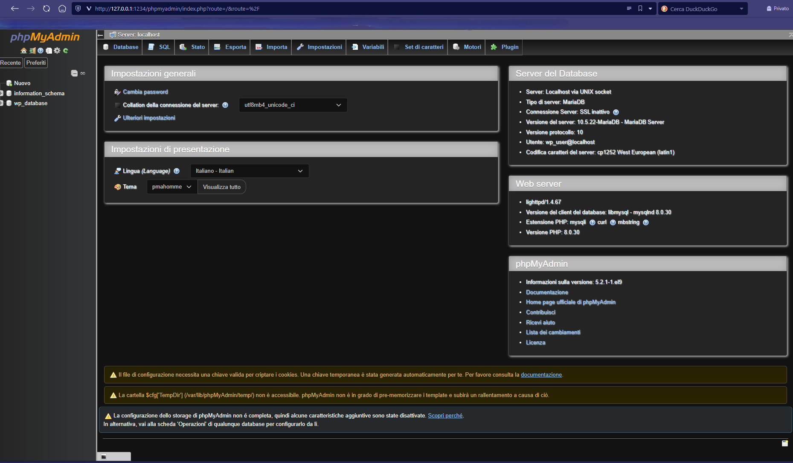

# Born2BeRoot: Rocky Edition - Bonus Track

 

La guida spiega passo dopo passo come installare una macchina virtuale RockyLinux e configurarla come webserver su cui si andrà ad installare WordPress.

## Prerequisiti:

- Ambiente virtualizzazione: VirtualBox [Download](https://www.virtualbox.org/wiki/Downloads)

- SO scelto: Rocky (9.5). Documentazione in Italiano [QUI](https://rocky-linux.github.io/documentation/RockyLinuxAdminGuide.it.pdf)!

Perché Rocky? Perché, dovendo realizzare una VM che, di fatto, fungerà da webserver volevo una distro più stabile. Rocky linux è l’erede di CentOS ed è basato su RHEL (Red Hat Enterprise Linux). La distribuzione è orientata all’ambito enterprise. Le sue caratteristiche sono:

- Stabilità --> essendo orientata alle aziende è una caratteristica necessaria

- Ciclo vita --> ogni versione ha un ciclo vita di almeo 10 anni

### Gestione dei Pacchetti:

Nei sistemi Unix/Linux i software possono essere installati fondamentalmente in 2 modalità. La prima è attraverso la compilazione dei sorgenti, mentre la seconda è utilizzare il sistema cosiddetto “a pacchetti”. Un pacchetto, in pratica, è un archivio dove sono presenti tutti i files necessari per l’instalazione di un dato programma ed
anche le dipendenze. In tal senso Rocky utilizza come packet manager [DNF](https://docs.rockylinux.org/guides/package_management/dnf_package_manager/).

Essendo derivata da RH, è compatibile con i pacchetti in formato .rpm. Da
notare che RPM è anche un comando, RPM (Red Hat Packet Manager). In realtà
bisogna stare attenti perché tale comando **NON** gestisce le dipendenze, quindi
tocca farlo manualmente. Per questo motivo ci sono i packet manager come DNF.

### [Download ISO](https://download.rockylinux.org/pub/rocky/9/isos/x86_64/Rocky-9.5-x86_64-minimal.iso)

Dovendo realizzare un webserver si è deciso di scaricare, ed installare, la versione minimal di Rocky. Tale versione è caratterizzata dal fatto che è un ambiente Linux minimale e contiene solo i pacchetti essenziali, cosa molto utile in configurazioni server. Inoltre la “minimal ISO” non necessità di collegamento a internet in quanto ha tutti i pacchetti necessari all’interno dell’immagine disco.

---

## SETUP VM

Aprire VBox e cliccare su “Nuova”, poi seguire i seguenti passi. 


###### Definizione dell'architettura

- RAM = 2GB

- Numero Processori = 1. Non ci saranno situazioni con carichi elevati quindi 1 CPU basta e avanza

- Abilita EFI: NO, non è necessario


###### Disco Virtuale

Dimensione da 30.8Gb (per Bonus). Non necessaria la preallocazione a dimensione intera. 


Sulla schermata successiva di riepilogo cliccare su FINE


Avviare la VM facendo doppio click sull’icona appena creata nella schermata principale di VBox. Automaticamente verrà montata l’immagine .iso ed eseguita per poter installare il sistema operativo.

---

## Installazione di Rocky Linux

Dopo l’avvio comparirà questa schermata.


Procedere con “Test this media & install Rocky Linux 9.5”.  Premendo Enter si accede all’interfaccia grafica dove si andranno ad impostare tutti i vari parametri di installazione.


Utilizzando il mouse si potrà accedere alle varie sezioni da configurare. Sorvoliamo quelle relative alla “Localizzazione” in quanto autoesplicative. L’unica cosa è che nei PC della 42 Firenze il layout delle tastiere è *USA International*. Quindi tenerne conto. Dato che io sto installando la VM sul mio pc, con layout *ITA*, ho inserito anche questo layout in quelli disponibili e lo cambiero alla bisogno (dopo l’installazione). La sezione “Software” la lasciamo così com’è. Concentriamoci quindi sulle sezioni successive:

### IMPOSTAZIONI UTENTE

- Necessario impostare una password di root. Mi raccomando di tener disabilitata l’opzione di accesso come root via SSH (richiesto dal subject)

- Già che ci siamo impostiamo anche un utente come richiesto. Questa operazione potrebbe essere fatta anche successivamente via linea di comando ma tanto vale approfittarne. Per impostare l’utente entrare in “Creazione Utente” e compilare i campi come segue: 

   - Nome Completo: non necessario.

   - Nome utente: impostare il nome utente che hai in 42.

   - Flaggare le opzioni “Imposta questo utente come amministratore” e “Richiedi una password per usare questo account”

   

Già che ci siamo entriamo anche nella configurazione avanzata per associare già da adesso a questo utente l’appartenenza al gruppo sudo (NB: in Rocky, CentOS e nelle distro RHEL il gruppo sudo si chiama wheel!!!) ed al gruppo user42 (come da subject).


Salvare le modifiche, premere su “Fatto” e passare alla fase successiva.

### SISTEMA: questa sezione è quella più “complessa”, soprattutto la parte che riguarda il partizionamento che tratteremo per ultima.

**KDUMP**: come specificato nel subject non è necessario per Rocky quindi lo andiamo a disabilitare togliendo la spunta


**Rete&HostName**: non c’è molto da configurare qui se non l’Host Name. Si potrebbe fare anche da linea di comando ma tanto vale farlo adesso. Il nome deve finire con “42” come da istruzioni.


**Security Profile**: è necessario abilitarlo per avere SELinux attivo come da requisiti. Non è necessario selezionare alcun profilo specifico. Di default verrà attivata SELinux in modalità “enforced” ed applicato un profilo “targeted” come da istruzioni


Questo dovrebbe essere corrispondente al profilo  mostrato nel testo del subject.


**Destinazione Installazione**: qui si accede per andare a partizionare il disco. Necessario quindi selezionare il disco e poi fare il partizionamento manuale

La 1 cosa da fare: selezionare il disco e spuntare come “Configurazione di archiviazione” --> “personalizzato”. 


A questo punto cliccare su “Fatto”. Si aprirà quindi il menù di configurazione delle partizioni da cui incominciare a partizionare il disco.

0) Se ci sono partizionamenti precedenti eliminarli con il tasto ‘-‘ dopo averli
   selezionati. Ci si troverà quindi in una situazione dove si avranno 30.8GiB di
   spazio disponibile / 30.8GiB di spazio totale

1) Creare una prima partizione con punto di mount = "*/boot*". Tale partizione sarà di tipo primario e di dimensione 512MiB (è la dimensione consigliata da Rocky)

2) Creare una seconda partizione con punto mount = "*biosboot*". Tale partizione farla da 1KiB à in automatico in realtà rocky imposta 1MiB (1024KiB) che è il minimo per questo tipo di distro

3) Iniziare a creare le partizioni logiche con LVM. Bisogna impostare come tipo di dispositivo “LVM” per ogni partizione che si andrà a creare e associarla al
   gruppo di volumi corrispondente. Il gruppo di volumi sarà quello standard
   creato. Il nome è a piacere. Io l’ho nominato con “vg0” (volume group 0).
   Andando a cliccare su “modifica” è necessario mettere la spunta su “cripta”.
   Realizzare quindi un volume tanti quanti ne sono richiesti. NB: per il volume
   di SWAP è necessario impostare il mount point = "*swap*".


NB: la formattazione utilizzata è *xfs* in quanto più performante rispetto a *ext4* ed orientata all’utilizzo con database ed archiviazione di file di grandi dimensioni. Inoltre ha un’alta affidabilità. 

Alla fine la situazione risultante dovrebbe essere la seguente:


Premere quindi su “Fatto”. A questo punto verrà richiesto di impostare una password di encryption. Fatto questo verrà mostrato un riepilogo delle modifiche effettuate. Cliccare su “Accetta” se è tutto corretto.


Alla fine di tutto quindi dovremmo essere in grado di procedere con l’installazione cliccando su “Avvia installazione". 

Riepilogo della configurazione impostata.


Cliccare su “Avvia installazione”

**EUREKA!**


Riavviamo e procediamo con la messa a punto del sistema operativo!

Una volta riavviata la macchina verrà richiesta la password per la crittografia del disco ed il login. Immettere i dati precedentemente impostati. Come login possiamo o utilizzare il `root`, oppure il nostro  utente generato che tanto dovrebbe avere i permessi di amministratore. L’unica cosa, in quest’ultimo caso è che i comandi che andremo ad immettere dovranno essere preceduti da `sudo`.

Verifichiamo quindi che sia tutto in regola.

1. Verifica partizionamento con `lsblk` dovremmo avere un output come questo: 
   
   

2. Verifica dell’installazione e del sistema operativo: `head -n 2 /etc/os-release`
   
   

3. Verifica corretta attivazione SELinux: `sestatus` 
   
   

Adesso andremo ad impostare il sistema per rispettare i requisiti richiesti.

PS: in caso si volesse cambiare temporaneamente il layout della tastiera (fino al successivo riavvio della macchina) è necessartio usare il seguente comando `sudo loadkeys <layout>` (it per italiano).

---

## Configurazione server SSH

Prima di tutto controlliamo che sia tutto aggiornato: `sudo dnf update`. E’ probabile che ci metterà un po' perché ci sono parecchi pacchetti che andranno aggiornati. Per poter gestire varie opzioni relative alle porte di rete è necessario installare il manager di *SELinux*. Lo facciamo con il seguente comando: `sudo dnf install policycoreutils-python-utils`.

In pratica adesso saremo in grado di andare a configurare il traffico su determinate porte. Da qui, infatti, configureremo il sistema per poter funzionare con il protocollo SSH. 

Verificare lo stato delle porte tramite: `sudo semanage port -l | grep ssh` (relativo al server SSH). 

Si dovrebbe ottenere un output di questo tipo:


Ci indica che è abilitata solo la porta 22 su protocollo tcp. 

Dobbiamo aggiungere quindi alla regola la porta 4242 tramite il seguente comando: `sudo semanage port -a -t ssh_port_t -p tcp 4242`. Andando ad eseguirlo e ritestando lo stato si dovrebbe ottenere il seguente output


Adesso la porta 4242 per ssh su protocollo tcp è consentita. Riavviare il sistema con `sudo reboot` (giusto per essere sicuri).

**Firewall**. Il comando da utilizzarsi è `firewall-cmd` (è diverso da quello utilizzato su Debian!) seguito dall’istruzione che vogliamo eseguire. Per poter passare al primo punto da fare (servizio SSH) dobbiamo aprire la porta 4242. Lo facciamo con: `sudo firewall-cmd --add-port=4242/tcp  --permanent`. Ricarichiamo quindi le impostazioni con `sudo firewall-cmd --reload`. 

Verifica e messa a punto del servizio SSH --> per prima cosa verifichiamo che il servizio sia installato ed attivo: `sudo systemctl status sshd` 


Adesso dobbiamo modificare il file di configurazione SSH. Tale file si trova in `/etc/ssh/sshd_config`. Apriamolo con VIM utilizzando il comando: `sudo vi  /etc/ssh/sshd_config`. Aperto il file dobbiamo cercare il campo “Port” e cambiarlo  inserendo 4242. Se “Port” è preceduto da ‘#’ eliminiamolo perché è un commento. Già che ci siamo dobbiamo anche verificare il fatto che non sia consentito il login root via SSH. Questo si fa impostando il seguente campo: “PermitRootLogin no”. Se non presente aggiungerlo. 


Fatto questo riavviamo il servizio con il comando: `sudo systemctl restart sshd` e ricontrolliamo che il tutto sia correttamente: `sudo systemctl status sshd`.

Si dovrebbe ottenere questo output 


NB: Attenzione che ci sono 2 file di configurazioni, ovvero “ssh_config” e “sshd_config”. Quello sshd è relativo al server ed è quello che va modificato!

Procediamo quindi a testare la nostra connessione al server SSH sulla macchina virtuale. Lo faremo in 3 step: 

1) Andiamo a testare la connessione direttamente all’interno della VM. Proseguiamo quindi andando ad inserire i seguenti comandi
   
   - `ip addr show` andiamo a vedere qual è l’indirizzo IP della VM
     
     troviamo 2 schede di rete. Una è la scheda di rete di loopback (interfaccia di rete interna). In generale l'indirizzo di loopback è sempre 127.0.0.1. Tale indirizzo è altresì denominato "localhost". L'altro indirizzo è quello della scheda di rete "reale". Tale indirizzo è 10.0.2.15. 
   
   - `ssh -p 4242 <utente>@localhost` ovviamente *utente* sarà lo user che avete impostato in precedenza. Si otterrà il seguente output. Proseguire digitando “yes” quindi inserire la password quando richiesta. Se la connessione è avvenuta otterremo un messaggio di output del tipo “Last Login: Data Ora” 
     
     
     A connessione avvenuta digitare `exit` per chiuderla e tornare alla sessione precedente.

     
   
   - Eventualmente ripetere il punto di cui sopra utilizzando l'indirizzo IP della VM (10.0.2.15 nel nostro caso). Si dovrebbe ottenere lo stesso risultato 
     
     

2) Test dal nostro pc (HOST) su cui gira Virtual Box. In caso si utilizzasse Windows è molto comodo utilizzare il sw [Putty](https://www.chiark.greenend.org.uk/~sgtatham/putty/latest.html). Dato che la VM, per impostazione di default, utilizza il NAT (Network Address Translation) dobbiamo poter accedere alla nostra VM dall’esterno. In pratica il NAT gestisce una rete separata rispetto alla nostra (quella del PC dove stiamo lavorando). Dobbiamo quindi comunicare al NAT come indirizzare il traffico di rete. Nello specifico questo si fa dalle impostazioni di rete avanzate della VM. 

   Procedere quindi impostando i campi come segue.
   
   

Prima di tutto dobbiamo precisare che l’Host è il nostro PC mentre il Guest è la VM. La porta guest è la 4242 come impostato precedentemente. La porta Host per semplicità la mettiamo uguale ma potremmo utilizzarne anche un’altra libera a nostro piacimento. La cosa importante è che dal nostro PC poi ci colleghiamo sulla porta “Host” per collegarci alla VM. Il NAT si preoccupa di inoltrare il traffico dal nostro PC alla porta selezionata. Per il collegamento è necessario utilizzare l’IP local Host (127.0.0.1). Di seguito uno schema di connessione di rete

```py
+--------------------+     +---------------------+     +--------------------+
|      PC (HOST)     |     |        NAT          |     |        VM (GUEST)  |
|  IP: 192.168.1.1   |<--->| Traduzione degli IP |<--->| IP: 10.0.2.15      |
|Localhost: 127.0.0.1|     | Forwarding Porte    |     |Localhost: 127.0.0.1|
+--------------------+     +---------------------+     +--------------------+
```

NB: il discorso dell’impostazione del NAT ci servirà anche successivamente quando andremo a configurare il wbserver e il WordPress. Eventualmente se non si volesse utilizzare il NAT si potrebbe optare per una connessione con bridge di rete dove la VM sarebbe vista come un computer facente parte della stessa rete di quello su cui stiamo lavorando. **ATTENZIONE**: sui pc della 42 è molto probabile che le porte qui menzionate siano già state riservate. Per es se nel PC della 42 la porta 4242 è già stata riservata per altro ovviamente non potrà essere utilizzata come “Porta dell’host”. Sarà quindi necessario usarne una libera e, quando ci colleghiamo alla nostra VM è necessario utilizzare la porta che abbiamo scelto. Per verificare se la 4242 è occupata sarà necessario, sul pc della 42, digitare questo comando da terminale: `ss -tuln | grep “4242”` --> se abbiamo come risultato una riga allora è occupata.

Adesso apriamo Putty ed inseriamo i parametri corretti per collegarci alla VM via SSH.

Cliccare su “Open” e ci verrà richiesto nome utente e password per collegarci alla VM.


Come si vede la connessione è avvenuta con successo. Adesso ci si può concentrare sul resto del progetto.

NB: In caso non usaste Putty (e Windows) e voleste collegarvi alla VM direttamente da un HOST Linux basterà da terminale andare ad eseguire il comando (visto in precedenza): `ssh -p HOST_PORT <utente>@localhost`. Ovviamente ci si sta riferendo ad una configurazione di rete con NAT in cui ho fatto il forwarding delle porte dalla porta HOST_PORT --> GUEST_PORT (4242).

---

## Impostazione della password policy

Come da subject dobbiamo implementare una policy delle password andando a creare le seguenti regole. Le regole delle password sono gestite in differenti moduli a seconda di ciò che si vuole fare. Nello specifico individuiamo 2 files da andare a configurare: `/etc/login.defs` e `/etc/pam.d/system-auth`. 

| Campo                                             | Valore            | Files di configurazione  | Note      |
| ------------------------------------------------- | ----------------- | ------------------------ | --------- |
| scadenza                                          | 30gg              | `/etc/login.defs`        |           |
| giorni minimi per reimpostare                     | 2gg               | `/etc/login.defs`        |           |
| warning scadenza pwd                              | 7gg prima         | `/etc/login.defs`        |           |
| Lunghezza minima                                  | 10 caratteri      | `/etc/pam.d/system-auth` |           |
| contiene uno di ciascun gruppo di caratteri       | (A-Z) (a-z) (0-9) | `/etc/pam.d/system-auth` |           |
| NO + 3 caratteri == consecutivi                   |                   | `/etc/pam.d/system-auth` |           |
| NON può contenere il nome utente                  |                   | `/etc/pam.d/system-auth` |           |
| Min 7 caratteri non presenti nella pwd precedente |                   | `/etc/pam.d/system-auth` | NO x ROOT |

Andiamo quindi ad impostare i criteri su `/etc/login.defs` come segue (apriamo con VIM il file testuale e cambiamo i seguenti campi)


Per i requisiti successivi dobbiamo modificare il file `/etc/pam.d/system-auth`. E’ necessario comprendere che le varie funzionalità sono garantite da diversi moduli sw, quindi a seconda di quello che vogliamo fare andiamo a modificare la linea relativa al modulo corrispondente. Nello specifico possiamo far riferimento alla tabella seguente:

| Campo                                                         | Valore           | Modulo           | Parametro                                              |
| ------------------------------------------------------------- | ---------------- | ---------------- | ------------------------------------------------------ |
| Lunghezza minima                                              | 10 caratteri     | pam_pwquality.so | minlen (=10)                                           |
| contiene uno di ciascun gruppo di caratteri                   | (A-Z)(a-z) (0-9) | pam_pwquality.so | minclass (=3) ucredit (=-1) lcredit (=-1) dcredit (=-1)|
| NO + 3 caratteri == consecutivi                               |                  | pam_pwquality.so | maxrepeat (=3)                                         |
| NON può contenere il nome<br> utente                          |                  | pam_pwquality.so | usercheck                                              |
| Min 7 caratteri non presenti nella pwd precedente (NO x root) |                  | pam_pwquality.so | difok (= 7)                                            |

*`minclass`* mi dice quante categorie almeno deve contenere la password. Non mi indica però quali, per questo motivo debbo combinarlo con il sistema di credit (ucredit --> maiuscole, lcredit --> minuscole e dcredit --> numeri) per ottenere il comportamento desiderato. 

Tutti questi requisiti fanno parte del modulo pam_pwquality. Per soddisfare il subject dobbiamo far si che tutti (tranne l’ultimo) siano applicati anche a root. Per questo motivo dobbiamo usare la regola *`enforce_for_root`* alla fine del comando. Per quanto riguarda l’ultimo requisito lo mettiamo a parte così `root `non ne sarà affetto. Alla fine quindi le righe da aggiungere sono 2 (in realtà potevo cambiare la prima riga inserendo anche le altre regole valide per tutti ma ho preferito lasciarla cosi per differenziare le modifiche fatte da me rispetto alla conf originale del file). 

Apriamo con VIM il seguente file: `/etc/pam.d/system-auth` ed inseriamo le parti evidenziate in giallo


OK adesso la policy della password è sistemata. Alla fine proveremo a testarla andando a creare un nuovo utente, assegnandogli una password di default e poi andandola a modificare. Ovviamente proveremo anche a modificare la password di root e verificare che l’istruzione difok non venga applicata. Tratteremo la cosa in un capitolo a parte.

---

## Impostazione policy `sudo`

Come da requisiti procediamo a definire le policy che regolano l’utilizzo del comando `sudo` (esecuzione di comandi in modalità amministratore).
Il file di configurazione lo troviamo in *`/etc/sudoers`*. In questo caso invece di utilizzare il nostro editor di testo per modificare tale file vado ad usare il comando `sudo visudo` che in pratica mi fa modificare la configurazione andando a testarne anche la sintassi. E’ quindi più sicuro.

| #   | Descrizione                                                                                                                                                                   | Comando                                                                                                       |
| --- | ----------------------------------------------------------------------------------------------------------------------------------------------------------------------------- | ------------------------------------------------------------------------------------------------------------- |
| 1   | L'autenticazione con sudo deve essere limitata a 3 tentativi in caso di una password errata                                                                                   | `Defaults passwd_tries=3`                                                                                     |
| 2   | un messaggio personalizzato, di tua scelta, deve essere mostrato se è immessa una password errata                                                                             | `Defaults badpass_message="Msg"`                                                                              |
| 3   | ogni azione usando sudo deve essere loggata (sia input che output) e salvata in `/var/log/sudo/` NB: assicurarsi che la dir esista ed abbia i permessi corretti (`chmod 700`) | `Defaults iolog_dir="/var/log/sudo"`<br> `Defaults logfile="/var/log/sudo/sudo.log"`<br> `Defaults  log_input,log_output` |
| 4   | la modalità TTY deve essere abilitata per motivi di sicurezza                                                                                                                 | `Defaults requiretty`                                                                                         |
| 5   | per sicurezza i path usati da sudo devono essere ristretti a: `/usr/local/sbin` `/usr/local/bin` `/usr/sbin` `/usr/bin` `/sbin` `/bin` `/snap/bin`                                       | `Defaults secure_path="/usr/local/sbin:/usr/local/bin:/usr/sbin:/usr/bin:/sbin:/bin:/snap/bin"`                                                                                 |

Spiegazione di cosa fanno i comandi:

1. Imposta il massimi tentativi di inserire la password a 3. Vuol dire che se sbaglio per oltre 3 volte devo rilanciare il comando sudo

2. Mostra un messaggio customizzato se sbaglio la passwoed

3. Imposta il logfile nel percorso specificato (`/var/log/sudo`). Inoltre imposta il log sia pre l’input che per l’output. Necessario verificare che la dir sia esistente ed impostare il chmod a 700. Occhio che `log_input,log_output` va scritto cosi senza lo spazio dopo la ‘,’. 

4. Posso chiamare `sudo` solo da terminale, ovvero non può essere lanciato tramite script o altro

5. Limita i percorsi da cui `sudo` può eseguire i comandi. Se per es ho uno script in una posizione “non sicura” il comando sudo non me lo eseguirà.

---

## Generazione dello script di monitoraggio

Adesso passiamo alla generazione dello script per monitorare le risorse. Tale script dovrà essere di proprietà di root ma avere i permessi di esecuzione per tutti gli utenti. Inoltre deve essere  lanciato in avvio e chiamato ogni 10min. Per quest ultimo punto ci possono essere varie strade tra cui:

- Implementazione ciclo while infinito nello script stesso. Sarebbe necessario comunque configurarne l’esecuzione automatica in avvio. Non è una strada furba in quanto girerebbe sempre all’infinito

- Utilizzare un servizio che si occupa di processi periodici. Il sistema ce ne fornisce 2:
  
  1. cron
  
  2. systemd

Si prediligerà l’uso di cron in quanto più semplice da gestire e con basso carico. Considerata la semplicità dello script non ha senso andare ad usare systemd. Altra cosa preliminare è dove andare a posizionare lo script. Lo metto in `usr/local/bin` che è una directory abbastanza standard per questo tipo di attività.

Elenco di risorse da monitorare:

| #   | Grandezza da monitorare                   | Comando principale                                                                   |
| --- | ----------------------------------------- | ------------------------------------------------------------------------------------ |
| 1   | architettura del SO e<br> versione Kernel | `uname -m -r`                                                                        |
| 2   | numero di processori fisici               | `lscpu \| grep "Core(s)" \| awk '{print $4}'`                                        |
| 3   | numero di processori<br> virtuali         | `nproc`                                                                              |
| 4   | RAM utilizzata                            | `free -h \| grep "Mem:" \| awk '{print $3}'`                                         |
| 5   | RAM Totale                                | `free -h \| grep "Mem:" \| awk '{print $2}'`                                         |
| 6   | %RAM Utilizzata                           | `free \| awk '/^Mem:/ {printf "%.1f", $3/$2 * 100}'`                                 |
| 7   | Spazio su disco usato                     | `df -h --total \| grep "total" \| awk '{print $3}'`                                  |
| 8   | Spazio su diso Totale                     | `df -h --total \| grep "total" \| awk '{print $2}'`                                  |
| 9   | % Spazio su disco usato                   | `df -h --total \| grep "total" \| awk '{print $5}'`                                  |
| 10  | Carico CPU in %                           | `top -bn1 \| grep "Cpu(s)" \| awk -F'[:, ]+' '{print 100 - $8"%"}'`                  |
| 11  | Data e Ora ultimo reboot                  | `who -b \| awk '{print $3, $4}'`                                                     |
| 12  | Stato LVM                                 | `(if [ "$(vgs --noheadings \| wc -l)" -gt 0 ]; then echo "yes"; else echo "no"; fi)` |
| 13  | Numero di connessioni attive              | `ss -ta \| grep "ESTAB" \| wc -l`                                                    |
| 14  | Numero di utenti loggati                  | `users \| wc -w`                                                                     |
| 15  | Indirizzo IP v4                           | `hostname -I \| awk '{print $1}'`                                                    |
| 16  | MAC Address                               | `ip link \| grep "link/ether" \| awk '{print $2}'`                                   |
| 17  | numero di comandi eseguiti<br> con sudo   | `journalctl _COMM=sudo \| grep "COMMAND" \| wc -l`                                   |

In realtà si possono ottenere le informazioni richieste in vari modi. Io ho scelto questi. Anche lo script può essere fatto in diverse maniere. Quello che segue è la mia interpretazione, non è né giusta né sbagliata ma è una delle tante. Da un punto di vista di idea ho scelto di memorizzare l’output di ogni comando e poi printarlo a schermo tramite sub-shell usando printf. In questo modo ho avuto la flessibilità di avere un formato come piaceva a me. Il comando wall consente di fare un broadcasting del messaggio a tutti gli utenti collegati.

```bash
#! /bin/bash

#Banner Personalizzato
print_banner(){
        echo "       ______  ______    __  _______  __ _________________  ___ "
        echo "      / __/\ \/ / __/   /  |/  / __ \/ |/ /  _/_  __/ __  \/ _ \ "
        echo "     _\ \   \  /\ \    / /|_/ / /_/ /    // /  / / / /_/ / , _/"
        echo "    /___/   /_/___/   /_/  /_/\____/_/|_/___/ /_/  \____/_/|_| "
        echo "                                                             "
}

ARCH=$(uname -m -r)
CPU_REAL=$(lscpu | grep "Core(s)" | awk '{print $4}')
CPU_VIRTUAL=$(nproc)
CPU_LOAD=$(top -bn1 | grep "Cpu(s)" | awk -F'[:, ]+' '{print 100 - $8"%"}')
RAM_USED=$(free -h | grep "Mem:" | awk '{print $3}')
RAM_TOT=$(free -h | grep "Mem:" | awk '{print $2}')
RAM_RAT=$(free | awk '/^Mem:/ {printf "%.1f", $3/$2 * 100}')
DISK_USED=$(df -h --total | grep "total" | awk '{print $3}')
DISK_TOT=$(df -h --total | grep "total" | awk '{print $2}')
DISK_RAT=$(df -h --total | grep "total" | awk '{print $5}')
LAST_REBOOT=$(who -b | awk '{print $3, $4}')
LVM_ACTIVE=$(if [ "$(vgs --noheadings | wc -l)" -gt 0 ]; then echo "yes"; else echo "no"; fi)
NET_CONN=$(ss -ta | grep "ESTAB" | wc -l)
USER_NUM=$(users | wc -w)
IP4_ADDR=$(hostname -I | awk '{print $1}')
MAC_ADDR=$(ip link | grep "link/ether" | awk '{print $2}')
SUDO_CNT=$(journalctl _COMM=sudo | grep "COMMAND" | wc -l)

collect_data(){
        printf "\t%-25s : %s\n" "Architecture & Kernel" "$ARCH"
        printf "\t%-25s : %s\n" "CPU(s) physical" "$CPU_REAL"
        printf "\t%-25s : %s\n" "vCPU(s)" "$CPU_VIRTUAL"
        printf "\t%-25s : %s/%s (%s%%)\n" "RAM Usage" "$RAM_USED" "$RAM_TOT" "$RAM_RAT"
        printf "\t%-25s : %s/%s (%s)\n" "Disk Usage" "$DISK_USED" "$DISK_TOT" "$DISK_RAT"
        printf "\t%-25s : %s\n" "CPU Load" "$CPU_LOAD"
        printf "\t%-25s : %s\n" "Last boot" "$LAST_REBOOT"
        printf "\t%-25s : %s\n" "LVM Active" "$LVM_ACTIVE"
        printf "\t%-25s : %s ESTABLISHED\n" "Connection(s) TCP" "$NET_CONN"
        printf "\t%-25s : %s\n" "User logged" "$USER_NUM"
        printf "\t%-25s : %s (%s)\n" "Network" "$IP4_ADDR" "$MAC_ADDR"
        printf "\t%-25s : %s\n" "sudo cmd count" "$SUDO_CNT"
}
{
    print_banner
    collect_data
} | wall
```

Ovviamente una volta fatto lo script è necessario testarlo andandolo ad eseguire. Mi raccomando di verificare che i permessi di esecuzione del file siano presenti. In caso li potete aggiungere con `sudo chmod +x </percorso/nomefile.sh>`. 

Detto questo, una volta che il test ha avuto esito positivo, passiamo ad implementare una regola periodica per l’esecuzione dello script. Come detto in precedenza  utilizzeremo `cron`. Per poterlo configurare è necessario editare un file in cui andremo ad inserire i dettagli sui processi (o comandi) che vogliamo eseguire periodicamente. Dovremo quindi creare un cron job. Procediamo quindi ad immettere il comando `sudo crontab -e` che ci permetterà di editare il cronjob.

Prima di scrivere il cronjob facciamo una rapida panoramica di come è fatto.

```lua
* * * * * /percorso/comando
- - - - -
| | | | |
| | | | +--- Giorno della settimana (0-7, dove 0 e 7 rappresentano la domenica)
| | | +----- Mese (1-12)
| | +------- Giorno del mese (1-31)
| +--------- Ora (0-23)
+----------- Minuto (0-59)
```

Ogni * rappresenta quindi una specifica tempistica. * è un carattere jolly, cioè vale qualsiasi cosa. Nel nostro caso, per far comparire il messaggio ogni 10 min dovremmo impostare così il comando:
`*/10 * * * *`
    \*/10  --> esecuzione ogni minuto divisibile per 10
    *     --> i restanti ‘*’ indicano che avverrà a qualsiasi ora, giorno del mese, mese, giorno della settimana. Mi raccomando tra un * e l’altro ci vuole lo spazio.
Altra nota è che dobbiamo dire al sistema di far partire il cronjob al boot. Per fare questo la sintassi sarà: `@reboot /percorso/comando`

Una cosa importante di cui mi sono reso conto è che, facendo un analisi del log di cron (`sudo tail -f /var/log/cron`) alcuni comandi usati nello script non venivano trovati. Per questo motivo ho dovto inserire un’ulteriore riga specificando il percordo dove trovare tali comandi:Il file crontab sarà quindi composto da un totale di 3 righe:

```bash
PATH=/usr/sbin:/usr/bin:/sbin:/bin
@reboot /usr/local/bin/sysmon.sh
*/10 * * * * /usr/local/bin/sysmon.sh
```

Fatto questo si salva e si esce dall’editor. Si dovrebbe ricevere un messaggio che il cronjob è stato installato. Mi raccomando prestare attenzione al fatto che è necessario eseguire `crontab -e` con diritti di amministratore, altrimenti si creerà un crontab per l’utente e non è quello che si vuole. Verifichiamo quindi che il cronjob sia effettivamente attivo tramite il comando: `sudo tail -f /var/log/cron`. Si otterrà un output simile a quello in figura.


Le ultime 2 righe ci stanno ad indicare che è stato inserito il comando relativo all’esecuzione dello script (`CMD`) e che ha avuto esito positivo (`CMDEND`). Fatto questo abbiamo finito. 

Di seguito l’output mandato ogni 10min in broadcasting. 


Prima di chiudere l’argomento e passare avanti faccio un breve riassunto dei comandi di cron in maniera che si sappia come stoppare/disabilitare/riabilitare tale servizio. Questo sicuramente sarà utile in fase di discussione evitando di avere il messaggio che compare ripetutamente

| Operazione                           | Comando                                 | Descrizione                                                          |
| ------------------------------------ | --------------------------------------- | -------------------------------------------------------------------- |
| Listare i cronjob dell'utente        | `crontab -l`                            | Mostra i cronjob attivi per  l'utente corrente.                      |
| Modificare i cronjob                 | `crontab -e`                            | Apre l'editor predefinito  per modificare i cronjob dell'utente.     |
| Aggiungere un cronjob                | `echo "*/10 * * * * /percorso/script"`  | Inserisce il cronjob puntato dal file indicato                       |
| Rimuovere i cronjob                  | `crontab -r`                            | Cancella tutti i cronjob dell'utente corrente.                       |
| Verificare lo stato del<br> servizio | `systemctl status crond`                | Mostra se il servizio cron è attivo o no.                            |
| Avviare il servizio cron             | `systemctl start crond`                 | Avvia il servizio cron.                                              |
| Fermare temporaneamente<br> cron     | `systemctl stop crond`                  | Ferma il servizio cron (i job non verranno eseguiti finché è fermo). |
| Riavviare il servizio cron           | `systemctl restart crond`               | Riavvia cron (utile dopo modifiche importanti).                      |
| Abilitare cron all’avvio             | `systemctl enable crond`                | Configura cron per partire automaticamente al boot del sistema.      |
| Disabilitare cron all’avvio          | `systemctl disable crond`               | Impedisce a cron di partire automaticamente al boot.                 |

---

## Installazione WordPress e Servizi aggiuntivi

Passiamo al prossimo punto del subject ma prima di partire con l’installazione di tutta la roba cerchiamo di capire cosa andremo a fare, e perché. Ci viene richiesto di mettere a punto un sito WordPress funzionante. 
Per fare questo abbiamo necessità dei seguenti componenti:

1. un webserver, ovvero un programma che risede nel nostro server e si occupa di dialogare attraverso il protocollo di rete (http) in maniera da recepire le informazioni richieste dagli utenti via browser e mandare indietro i dati. Il subject ci dice espressamente che il webserver deve essere lighttpd
2. un database dove verranno memorizzati i dati del sito (pagine/credenziali…). Dobbiamo installare MariaDB (fork di MySQL) a questo scopo
3. interprete PHP. PHP è un linguaggio di programmazione su cui si basa WordPress. Il PHP è un linguaggio interpretato, ovvero viene eseguito senza bisogno di compilazione preventiva. E’ uno standard attuale per lo sviluppo web dinamico.
4. Applicativo WordPress: piattaforma di gestione dei contenuti per il sito web
   Il bonus ci richiede anche di installare servizi aggiuntivi che riteniamo utili. Per quanto mi riguarda i servizi che andremo ad installare sono i seguenti:
5. Fail2Ban --> strumento di sicurezza con lo scopo di proteggere il server da tentativi di accesso non autorizzati
6. Let’s Encrypt (Certbot) --> strumento per ottenere certificati SSL gratuiti. In questo modo configuriamo il nostro server per poter utilizzare il protocollo HTTPS (e provare ad evitare che Mickey e l’Uomo D’Acciaio ci possano sniffare il traffico)
7. phpMyAdmin --> è un’interfaccia web per poter gestire con più facilità i database MariaDB.
8. Postfix (gestore email) --> per dare al nostro webserver funzionalità di invio mail. Potrebbe essere una cosa carina avere anche un server mail ma per lo scopo dell’esercitazione e della tipologia di sito possiamo tranquillamente saltare questo passo, oppure decidere di installare un plugin WordPress che fa proprio questo lavoro.

Prima di partire con le varie installazioni procediamo ad un aggiornamento del sistema con `sudo dnf update -y` (il -y serve a non chiedere conferma). Oltre a questo è necessario anche aggiornare i repository perché alcuni dei programmi che metteremo sono presenti in un repository extra (EPEL - Extra Packages for Enterprise Linux). Lo facciamo col comando: `sudo dnf install epel-release -y`

### 1. Lighttpd

```bash
sudo dnf install lighttpd lighttpd-fastcgi -y     #installazione Lighttpd e modulo fastcgi
sudo systemctl start lighttpd    #avvio del servizio
sudo systemctl enable lighttpd   #abilitazione servizio all’avvio del server
sudo systemctl status lighttpd   #verifica stato
```

Se tutto è ok dovremmo ottenere un output di questo tipo.

**Lighttpd**, quando è in servizio, ha un suo utente ed un suo gruppo. Dato che è "lui" che dovrà avere accesso alle risorse (pagine web) da mostrarci è necessario che i percorsi dove sono presenti tali files abbiano come owner lighttpd e come gruppo lighttpd. Andiamo quindi a verificare i permessi della directory `/var/www/lighttpd` tramite il seguente comando: `sudo ls -ld /var/www/lighttpd`. Se otteniamo un output come quello in figura allora non abbiamo necessità di cambiare i permessi. 

In caso contrario invece dovremmo eseguire i seguenti comandi:

```bash
sudo chown -R lighttpd:lighttpd /var/www/lighttpd    #imposta l'owner e il gruppo a lighttpd
sudo chmod -R 700 /var/www/lighttpd    #imposta i permessi di read/write/exec al proprietario
sudo systemctl restart lighttpd    #riavvia il servizio lighttpd
```

Adesso procediamo ad aprire le porte del firewall necessarie per il funzionamento del nostro webserver. Ovviamente dovremmo aprire la porta 80 (HTTP) ed anche la porta 443 (HTTPS) necessaria al servizio aggiuntivo che andremo a mettere. I comandi da eseguire saranno quindi:

```bash
sudo firewall-cmd --permanent --add-service=http    #abilita porta 80
sudo firewall-cmd --permanent --add-service=https   #abilita porta 443
sudo firewall-cmd --reload    #ricarica le impostazioni del firewall
```

Prima di chiudere il setup del server abbiamo necessità di fare una piccola modifica per essere certi che lighttpd ascolti da tutti gli ip che ne facciano richiesta. Anche se non è strettamente necessario è meglio fare questo passaggio per evitare possibili problematiche. Aprendo con VIM il file di configurazione (`sudo /etc/lighttpd/lighttpd.conf`) andiamo a scrivere la riga `server.bind = “0.0.0.0”`


Fatto questo quindi passiamo al test del server appena installato. Dobbiamo quindi verificare che le porte siano aperte anche su *SELinux* altrimenti potremmo incorrere in problemi di connettività (`sudo semanage -l | grep “http”`). Una volta che siamo sicuri che *SELinux* è a posto digitiamo il seguente comando da terminale: `sudo curl localhost:80`. Come output dovremmo avere il codice html della pagina principale di lighttpd. (provate ad usare curl anche con l’indirizzo di loopback, ovvero 127.0.0.1:80)


Adesso impostiamo anche la regola di forwarding delle porte su NAT e proviamo ad accedere al server tramite il nostro host (windows o Linux) attraverso il browser. Mi raccomando qui dovete impostare una porta che NON sia occupata sull'HOST (il pc che usate) altrimenti non riuscirete a collegarvi. Per quanto mi riguarda io ho usato la porta "1234" come da figura reindirizzata sulla porta 80.


Sistemato il NAT non ci resta che collegarci col browser su localhost alla porta selezionata andando ad inserire nella barra degli indirizzi: `http://127.0.0.1:1234`. Se tutto funziona si otterrà la seguente pagina web.

---

### 2. MariaDB

andiamo quindi di Maria. Procediamo alla sua installazione tramite i seguenti passaggi.

```bash
sudo dnf install mariadb-server    #va a scaricare ed installare MariaDB
sudo systemctl start mariadb       #avvio del servizio
sudo systemctl enable mariadb      #esegue il servizio all’avvio della macchina
sudo systemctl status mariadb      #mostra lo stato del servizio
```


Adesso passiamo alla configurazione di MariaDB. Per prima cosa dobbiamo lanciare uno script per configurarne la sicurezza attraverso: `sudo mysql_secure_installation`. Appena inserito il comando ci verrà richiesta la password di root, inserirla. 

Da qui abbiamo da configurare alcune impostazioni relative alla sicurezza.

| Domanda                               | Risposta | Commento                                                    |
| ------------------------------------- |:--------:| ----------------------------------------------------------- |
| Switch to unix_socket autentication?  | n        | avendo già un utente root configurato non è necessario      |
| Change the root password?             | n        | avendo già un utente root configurato non è necessario      |
| Remove anonymous users?               | Y        | rimuove utenti anonimi per login, impostazione di sicurezza |
| Disallow root login remotely?         | Y        | impedisci l’accesso root da remoto, per sicurezza           |
| Remove test database and acces to it? | Y        | da rimuovere il database test, possibili impatti sicurezza  |
| Reaload privilege tables now?         | Y        | applica immediatamente le modifiche                         |

Alla fine si otterrà una pagina simile


Finito di configurare il servizio di base sarà necessario creare un database per wordpress e le credenziali di login. Per fare questo dobbiamo entrare nella consolle di MariaDB con il comando `mariadb`. I prossimi step sono:

1. Creazione database per WordPress: `CREATE DATABASE <nomeDB>;` successivamente verifichiamo la corretta creazione con `SHOW DATABASES;`
   
   

2. Creazione utente:` CREATE USER '<user>'@'localhost' IDENTIFIED BY 'password';`
   
   

3. Assegnazione privilegi all’utente: `GRANT ALL PRIVILEGES ON <nomeDB>.* TO '<user>'@'localhost';`
   
   

4. Aggiornamento delle impostazioni appena inserite: `FLUSH PRIVILEGES;`
   
   

5. Fine: `EXIT`

---

### Installazione PHP

L’installazione in sé richiede l’esecuzione di: `sudo dnf install php php-fpm php-mysqlnd php-gd php-xml php-mbstring php-json php-opcache`. Il comando installa il motore PHP con tutta una serie di pacchetti aggiuntivi che servono per poter far funzionare WordPress in maniera ottimale. Di seguito l’elenco con la descrizione dei pacchetti installati.

| Pacchetto    | Descrizione                                                                                                                                                                                  |
| ------------ | -------------------------------------------------------------------------------------------------------------------------------------------------------------------------------------------- |
| php-fpm      | FastCGI Process Manager per PHP. È utilizzato per eseguire PHP in modo efficiente su server web come Lighttpd, Nginx e Apache. Offre una gestione delle risorse migliore rispetto a php-cgi. |
| php-mysqlnd  | MySQL Native Driver. Ottimizza la connessione tra PHP e MySQL/MariaDB, riducendo l'uso delle risorse e migliorando la performance rispetto al pacchetto php-mysql.                           |
| php-gd       | Supporta la manipolazione di immagini in PHP (creazione, modifica, elaborazione). Utile per generare immagini dinamiche e manipolare immagini caricate dagli utenti.                         |
| php-xml      | Fornisce il supporto per la gestione di documenti XML in PHP. Utile per elaborare e scambiare dati in formato XML, spesso usato in API e scambi di dati.                                     |
| php-mbstring | Gestisce stringhe multibyte (ad esempio, per lingue che utilizzano caratteri non ASCII). Essenziale per applicazioni multilingue o che gestiscono caratteri speciali.                        |
| php-json     | Supporta la codifica e la decodifica di dati in formato JSON. Fondamentale per applicazioni che scambiano dati tramite JSON, come le API RESTful.                                            |
| php-opcache  | Ottimizza le performance di PHP memorizzando in cache il codice pre-compilato PHP. Questo riduce il tempo di esecuzione delle richieste successive, migliorando le prestazioni.              |


Installati i pacchetti ansdiamo ad abilitare ed avviare PHP-FPM: il modulo che si occupa di stabilire la comunicazione con il server web lighttpd. Eseguiamo quindi i comandi:

```bash
sudo systemctl enable php-fpm    #abilita il modulo php-fpm all'avvio
sudo systemctl start php-fpm     #avvia il modulo php-fpm
```


Adesso procediamo a stabilire la connessione al server lighttpd. Su Rocky (e in generale su REHL) NON ci sono comandi per abilitare il FastCGI (protocollo di connessione PHPserverHTTP). Per fare questo dovremmo andare a fare 5 modifiche:

1. apriamo il file di configurazione del modulo php-fpm (`sudo vi /etc/php-fpm.d/www.conf`) ed andiamo ad impostare sia come <user> che come <group> "lighttpd", oltre che anche i `listen.group`, `listen.owner` e `listen.mode`. Inoltre commentiamo la riga `listen.acl_users`. Tutto questo garantirà l'accesso al socket a lighttpd
   
   ```ini
   ; Unix user/group of processes
   ; Note: The user is mandatory. If the group is not set, the default user's group
   ;       will be used.
   ; RPM: apache Choosed to be able to access some dir as httpd
   user = lighttpd
   ; RPM: Keep a group allowed to write in log dir.
   group = lighttpd
   
   ; Set permissions for unix socket, if one is used. In Linux, read/write
   ; permissions must be set in order to allow connections from a web server.
   ; Default Values: user and group are set as the running user
   ;                 mode is set to 0660
   listen.owner = lighttpd
   listen.group = lighttpd
   listen.mode = 0660
   
   ; When POSIX Access Control Lists are supported you can set them using
   ; these options, value is a comma separated list of user/group names.
   ; When set, listen.owner and listen.group are ignored
   ;listen.acl_users = apache,nginx
   ```

2. il file di configurazione di lighttpd (`/etc/lighttpd/lighttpd.conf`) aggiungendo la seguente riga (se non presente):
   
   ```ini
   server.modules += ("mod_fastcgi", "mod_rewrite")
   ```
   
   Possiamo testare se il nostro file d configurazione è corretto andando ad eseguire: `sudo -t -f lighttpd /etc/lighttpd/lighttpd.conf`. Se tutto ok si otterrà un messaggio `Sintax OK`

3. il file di configurazione del protocollo fastcgi che si trova in `/etc/lighttpd/conf.d/fastcgi.conf`. Prima di modificarlo però è necessario capire il modulo php-fpm su che porta sta ascoltando. Per fare questo lanciamo il comando `ss -lx | grep "php"`. Se otteniamo un output simile a questo allora stiamo comunicando sul socket Unix.

   Detto questo quindi andiamo ad aggiungere le seguenti linee di codice al file `/etc/lighttpd/conf.d/fastcgi.conf`:
   
   ```ini
   fastcgi.server += ( ".php" =>
     ( "localhost" =>
       (
         "socket" => "/run/php-fpm/www.sock",
         "max-procs" => 1
       )
     )
   )
   ```

5. Apriamo il file *modules.conf* (`sudo vi /etc/lighttpd/modules.conf`) e decommentiamo la riga `include conf_dir + "/conf.d/fastcgi.conf"`

6. Apriamo il file *php.ini* (`sudo vi /etc/php.ini`) e decommentiamo la riga: `cgi.fix_pathinfo = 1`

Bene adesso possiamo riavviare sia il server lighttpd che php-fpm con i comandi:

```bash
sudo systemctl restart php-fpm
sudo systemctl restart lighttpd
```

Dopo aver fatto tutte queste modifiche sarà necessario verificare che il server funzioni a dovere e che sia in grado di collegarsi al motore php in modalità FastCGI. Per fare questo andiamo a creare il file `phpinfo.php` in `/var/www/lighttpd`. Il file sarà quindi così composto:

```php
<?php 
phpinfo();
?>
```

Salviamo e chiudiamo il file. Successivamente assegnamo al file l’owner ed i permessi corretti con i comandi:

```bash
sudo chown lighttpd:lighttpd /var/www/lighttpd/phpinfo.php
sudo chmod 655 /var/www/lighttpd/phpinfo.php
```

Adesso proviamo ad accedere al file `phpinfo.php` sia da VM che da Host (browser). Nel 1 caso digitiamo da terminale `sudo curl http://127.0.0.1:80/phpinfo.php` dovremmo ricevere una cosa simile al seguente output:


Successivamente da browser ci colleghiamo alla pagina web http://127.0.0.1:1234/phpinfo.php e dovremmo ottenere (NB: 1234 è la porta che ho configurato sul NAT come “Porta HOST”) 


Si può notare come il protocollo FastCGI è funzionante correttamente. Abbiamo quindi testato che PHP è funzionante e comunica correttamente con lighttpd. Adesso andiamo a rimuovere il file `phpinfo.php` per questioni di sicurezza col comando: `sudo rm /var/www/lighttpd/phpinfo.php`

---

### 4. Installazione WordPress

Andremo a scaricare ed installare wordpress all’interno della cartella di lighttpd dedicata ai documenti. Per questo motivo andiamo ad eseguire i seguenti comandi:

```bash
sudo dnf install wget    #installazione wget: utility che mi permette di scaricare file da cli attraverso http/https e ftp
cd /var/www/lighttpd     #mi porto nella dir desiderata
wget https://wordpress.org/latest.tar.gz    #scarico dal sito l’ultima versione wordpress
sudo dnf install tar    #installazione utility per gestione archivi (comressione/decompressione)
sudo tar -xvzf latest.tar.gz    #estraggo i file dall’archivio
sudo rm /var/www/lighttpd/latest.tar.gz    #elimino l'archivio scaricato in precedenza
```

Adesso dobbiamo spostare la cartella `wordpress`, rinominarla in `lighttpd `e, contestualmente, rinominare l’attuale `lighttpd `in `lighttpd.old`. Questo lo faccio solo per mantenere la vecchia cartella di default e non cancellare i file standard presenti. Potremmo anche evitarlo andando a prendere tutti i file estratti nella dir `/wordpress` e spostarli nella dir `/var/www/lighttpd` ma preferisco fare diversamente per questioni di ordine. 

Cambiamo il proprietario e i permessi della cartella wordpress e di tutti i suoi files con i comandi:

```bash
sudo chown -R lighttpd:lighttpd /var/www/lighttpd/wordpress    #imposto proprietario e gruppo = a lighttpd per tutti i file presenti nella cartella
sudo chmod -R 700 /var/www/lighttpd/wordpress    #imposto i permessi r/w/x solo al proprietario
sudo mv /var/www/lighttpd /var/www./lighttpd.old    #rinomina la cartella lighttpd in lighttpd.old
sudo mv /var/www/lighttpd.old/wordpress /var/www./lighttpd    #sposta la cartella wordpress rinominandola in lighttpd
sudo systemctl reload lighttpd    #ricarico il server
```

Passiamo quindi al test di wordpress collegandoci direttamente col nostro browser a http://127.0.0.1:1234 ottenendo un output del tipo


Adesso dobbiamo connettere il db creato in precedenza e l’utenza a wordpress. Per farlo rinominiamo il file di configurazione `wp-config-sample.php` wordpress che si  trova in: `/var/www/lighttpd/wordpress/` andandolo a chiamare `wp-config.php`. Il comando sarà `sudo mv wp-config-sample.php wp-config.php` poi apriamo il file con VIM. Andiamo quindi a mettere nei campi evidenziati i valori che avevamo impostato per il nostro db mariaDB


Apriamo una nuova scheda del browser ed andando all’indirizzo http://127.0.0.1:1234 dovremmo avere questa schermata



Adesso possiamo impostare il titolo del nostro sito e creare l’utente che sarà  l’amministratore del sito. Tutti i campi sono a libera interpretazione. Il campo mail non è obbligatorio ma potrebbe essere necessario in caso di servizi che utilizzino l’email (o in caso di reset password). Tutte queste informazioni verranno memorizzate all’interno del database creato in precedenza. Inserire le informazioni richieste e premere su “Install WordPress” --> verrà aggiornato il database con le informazioni inserite e successivamente si potrà accedere al sito che si sta progettando con tali credenziali.



Si avrà quindi accesso alla pagina principale di wordpress dove poter configurare il sito ed i contenuti


Se accediamo al sito possiamo vedere una pagina precompilata


NB: da questo momento se accediamo all’indirizzo del nostro server http://127.0.0.1:1234 otterremo la pagina principale del sito. In caso volessimo loggarci come amministratori per poter effettuare modifiche dovremmo visitare http://127.0.0.1:1234/wp-admin

Proseguiamo quindi con l’installazione dei servizi aggiuntivi.

---

### 5. Fail2Ban

Servizio aggiuntivo che protegge il server bloccando automaticamente gli indirizzi IP che tentano ripetutamente di accedere senza autorizzazione. Serve in pratica ad evitare che qualcuno cominci a provare in ripetuta l’accesso con credenziali generate automaticamente. Procediamo quindi con i seguenti comandi:

```bash
sudo dnf update -y            #aggiorno repository sistema
sudo dnf install fail2ban -y        #installo fail2ban
sudo systemctl start fail2ban        #avvio del servizio
sudo systemctl enable fail2ban    #esecuzione all’avvio
```


Passiamo quindi alla configurazione del servizio…

- creiamo copia del file di configurazione (NON ELIMINARE IL FILE DI DEFAULT!). Comando: `sudo cp /etc/fail2ban/jail.comf /etc/fail2ban/jail.local`

- apriamo con VIM il file `/etc/fail2ban/jail.local` ed andiamo a modificare, a nostro piacimento, i seguenti parametri:
  
  - bantime = 600    -->    tempo di ban in secondi (10min)
  
  - findtime = 600    -->    periodo di tempo nel quale vengono monitorate le violazioni (10min).
  
  - maxretry = 5    -->    numero massimo di tentativi per bloccare un IP
  
  - già che ci siamo ne approfittiamo anche per abilitare la protezione anche sul protocollo ssh --> enabled = true
    
    

Provvediamo quindi a riavviare il servizio con il comando: `sudo systemctl restart fail2ban`. 

---

### 6. Let's Encrypt

Per avere funzionalità di crittografia ed abilitare il protocollo https dovremmo installare Certbot (client di Let’s encrypt) che ci fornisce i certificati SSL. Considerato che, in realtà, non abbiamo un dominio pubblico (dato che lavoriamo in VM) bisognerebbe creare un certificato autofirmato. Considerato che il gioco non vale la candela saltiamo questo passo ed andiamo al punto 7.

---

### 7. phpMyAdmin

è un'interfaccia web per gestire i database MySQL/MariaDB. Permetterà di gestire facilmente il tuo database tramite un browser, senza dover utilizzare la riga di comando.

```bash
sudo snf install phpmyadmin        #download ed installazione phpmyadmin
sudo ln -s /usr/share/phpMyAdmin /var/www/lighttpd/phpmyadmin    #collegamento a lighttpd attraverso link simbolico
```

Configurazione lighttpd per aggiungere accesso a phpMyAdmin. Apro con VIM `/etc/lighttpd/lighttpd.conf` ed aggiungo le seguenti righe di codice:

```ini
$HTTP["remoteip"] =~ "127.0.0.1|::1" {
            url.rewrite-once = ( "^/phpmyadmin($|/)" => "/phpmyadmin/index.php" )
}
```

Prima di concludere le operazioni andiamo anche ad impostare per sicurezza i permessi su file e cartelle di phpMyAdmin. Lo facciamo con i seguenti comandi:

```bash
sudo chown -R lighttpd:lighttpd /var/lib/php/session
sudo chmod 700 /var/lib/php/session
```

Salvato il file e riavviato il servizio lighttpd (`sudo systemctl restart lighttpd`) andando a visitare tramite il browser la pagina http://127.0.0.1:1234/phpmyadmin ci troveremo davanti il login al nostro db MariadB.




---

# “Attenzione è entrato un disturbo, l’output è sospeso…”

# “Attento, che forse ci stanno tracciando…”

# “CI STANNO TRACCIANDO!”

# “STACCA STACCA, STACCA!!!!!”


